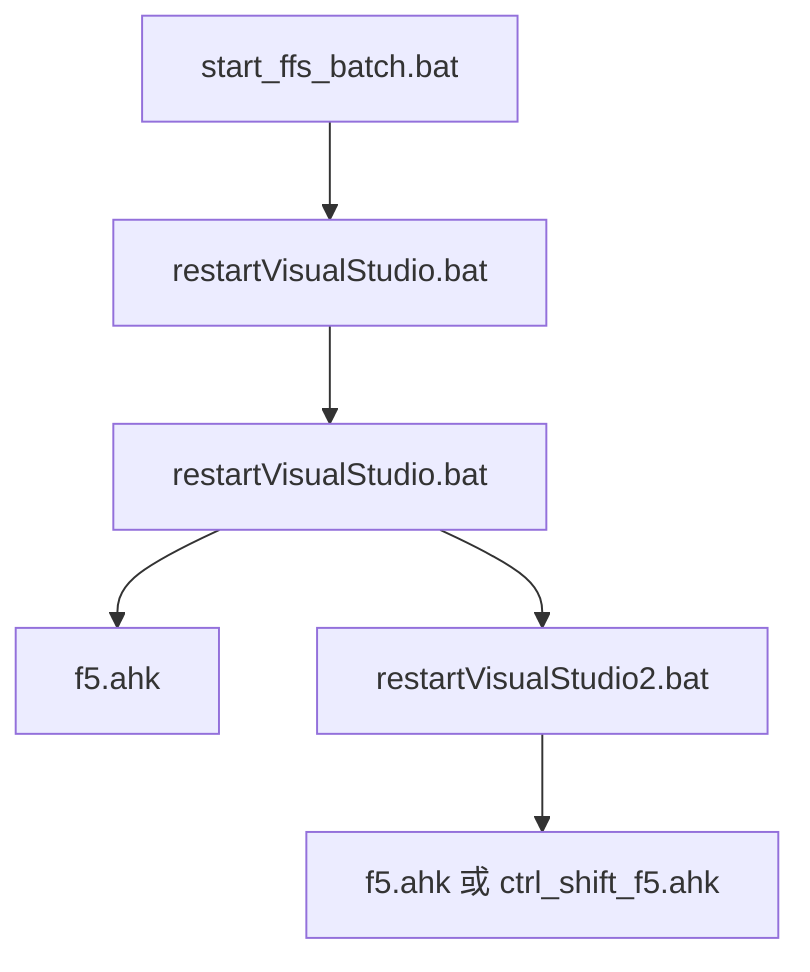
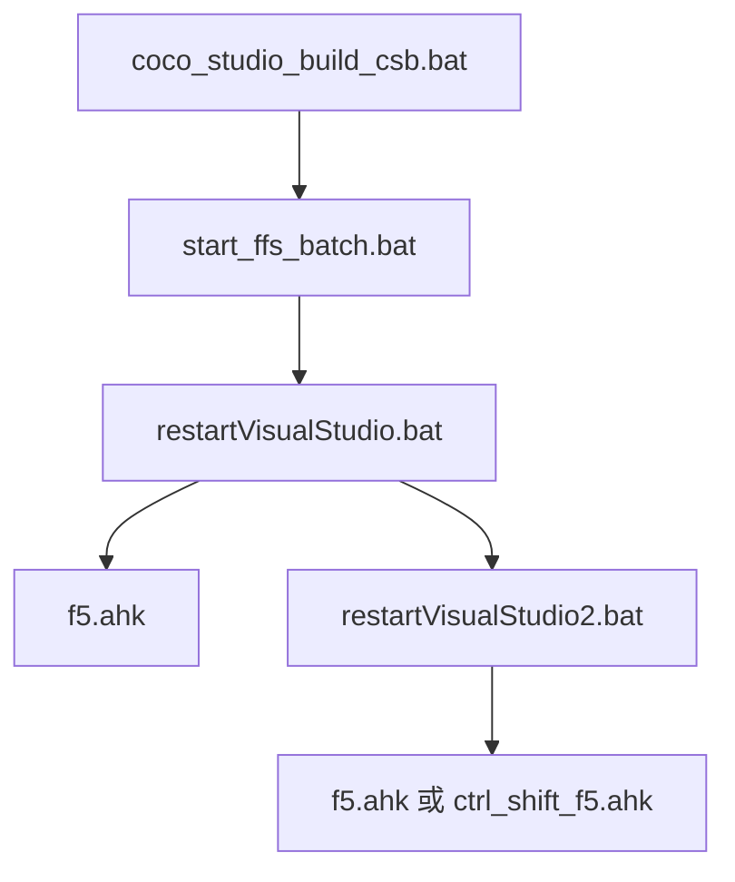

# CocosStudio_DevTool

- 自動編 cocos studio 資源，同步 cocos & lua 並 重啟 visual studio 的工具
- 使用 Visual Studio 2013，安裝路徑為系統預設
- 安裝 auto hit key v1.1.37.02，安裝後位置在: C:\Program Files\AutoHotkey

## 使用流程 (lua)

1. 修正 bat 及 ffs_batch 路徑
2. 執行 start_ffs_batch.bat

## 使用流程 (cocos & lua)

1. 修正 bat 及 ffs_batch 路徑
2. 執行 coco_studio_build_csb.bat
3. 輸入的參數可是: ALL 或 指定模組

## 程式流程

### lua

### cocos

